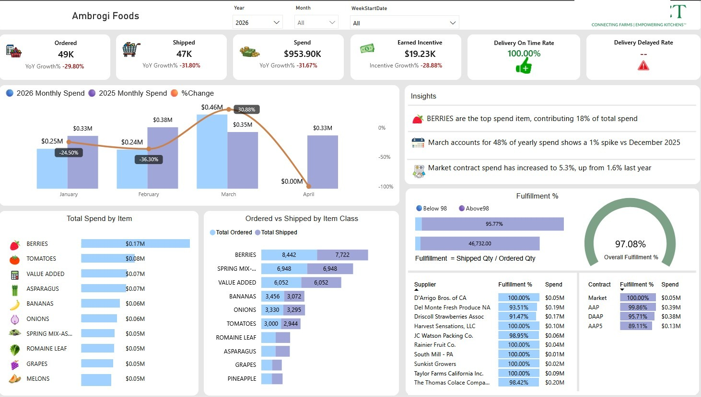

# 📊 Supply_Chain_Distributors - Power BI Project
This is sample dashboard page , of distributor report. In this Distributor Report there 15 pages are created, descending dollar, Supplier, Contract, YoY, MoM, WoW, Over vs Less Shipped, Opportunity, Incentive are the main report pages

## 🧠 Overview

This Power BI report is designed to analyze and monitor technician(Employee) work orders, time spent, activity types, and department productivity. It provides management and team leaders with a clear view of team efficiency, technician workload, and time utilization across different work orders or ptojects.

---

## 📌 Objectives
This Supply Chain or Produce business Distributors buy intems from suppliers then they will sold those to big restaurants 

Applied RLS , in this report , when ever a distributor loggied into the report they will be able to see there data only which strictly tied up and mainiting a RLS table in fabric DB.

Distributor will know his doller amt spend on what all items in different pespective, supplier , contract , YoY, MoM, WoW, Ordered vs Shipped vs Spend analysis.
Over shipped vs Shortage analaysis will be advantage for distribtor where he see shortage of orders delivery.
Opportunity also is main to see last year he didnt purchased items will be shown so that distributor focuss on lost items.

---

## 📸 Screenshots

### 🔹 Dashboard Page

---

## 🛠️ Tools & Technologies Used

- **Power BI** for report creation and data modeling.
- **Fabric - Ware house** asset management software (data source and operations integration).
- **Data Flow Gen2** for report creation and data modeling.
- **RLS** for report creation and data modeling.
- **Power BI App** for report creation and data modeling.

---

## 👨‍💻 About Me

Hi, I'm **Pagidi Ramesh**, a Power BI Developer with ** years of professional experience**. I have independently developed, delivered, and maintained end-to-end analytics solutions. I'm also experienced in training others — having mentored 3 colleagues on Power BI & developed End-To-End 10 + reports.

- 📬 **Email**: ramshpagidi2@gmail.com  
- 🔗 **LinkedIn**: [pagidi-ramesh](https://www.linkedin.com/in/pagidi-ramesh-477a09211)  
- 🧑‍💼 **Role**: Power BI Developer | Azure Data Engineer | Python Data Analyst

+
